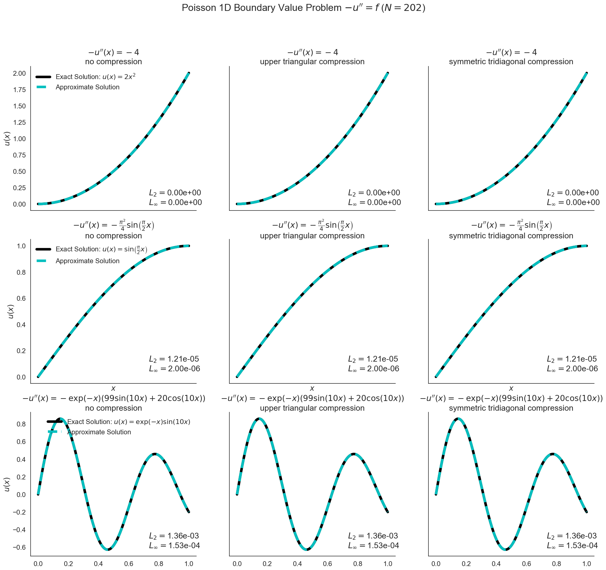

# Poisson 1D numerical BVP solver

This is my final project for AMS 562.
## TL;DR: Running the project

To run the driver program and generate the data, one can simply execute

```
$ make
```

To generate the data plots (given the existence of the data), one can simply
execute

```
$ ./generate_plots
```

## Description

The 1D Poisson equation is specified by _-u'' = f_ on the interval [_a_,_b_],
where _f_ is continuous and _u_ is the desired function to be solved.  This
project implements a finite differencing scheme for determining the function
_u_.  This scheme reduces to solving a special linear system _Ax = b_ where _A_
is symmetric, tridiagonal, and positive definite. The suite provided in the
`solvers` library implements this scheme using three different matrix storage
methods:

1. Square, dense matrices (`LuSolver`), which implement no data compression at
   all.
2. Packed upper triangular matrices (`PpSolver`), which exploits the symmetric
   property of _A_.
3. Packed symmetric tridiagonal matrices (`TriDiagonal`), which exploits both
   the symmetric and tridiagonal properties of _A_.

For any of these methods to work, the matrix _A_ must be positive definite.


## Driver program

With these distinct storage methods, the driver program `solvers/main.cpp`
tests them on simple Poisson problems. These problems involve functions _f_
which can be readily integrated in order to determine the exact solution _u_.
For each sample function and for each storage method, it compares the exact
solution with the computed solution according to the finite differencing scheme
by computing the L2 and LInf norm errors between them. It also writes the
computed and exact solutions to a set of files in the `data` directory.

## Data visualization

The Python script `generate_plots` takes data generated from the driver program
and plots the computed and exact solutions. For every problem with a specified
function _f_ and storage method, the resulting solutions are plotted in
individual graphs. The L2 and LInf norm errors are displayed as well. All of
these solutions are also plotted in an additional compiled figure.



### Dependencies

The script requires a Python 3 interpreter and uses the following dependencies:

* numpy(==1.12.1)
* matplotlib(==2.0.2)

For prettier graphs, it pays to have the `seaborn` library installed as well.

## Discussion

This scheme is startlingly accurate for these toy problems. I would like to
find a more interesting function to generate data for, perhaps then to show the
limits of finite differencing. But for these examples, the finite difference
method is highly successful.
